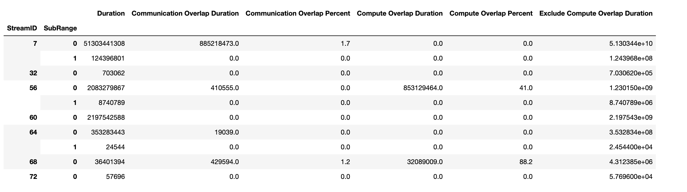
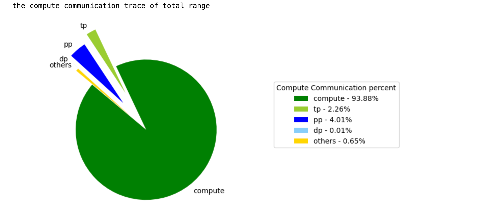
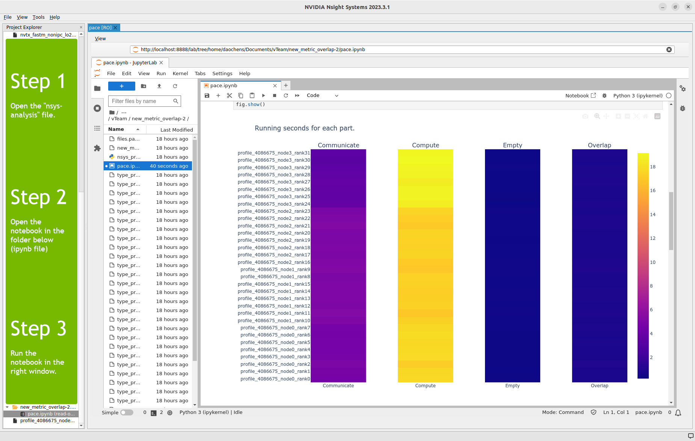

# nsys_recipes
## Introduction
these recipes are a supplement to nsight system‘s build in multi-report recipe.
currently we have two custom recipe
**compute_comm_trace**:
the compute_comm_trace recipe is modified from nccl_gpu_overlap_trace, add support for show the percent of compute, TP communication, PP communication, DP communication and others.
it output the static of compute and communication of different stream. users have to manually set TP, DP, PP stream id for plot.
the dataframe of different stream:

the pie of compute, and communication introduced by different parallelism:
  

**new_metric_overlap**:
This recipe is simply analysised from the reports and calculate how many time spend on each category:
- Communication (mainly NCCL calls)
- Computation (math computation or other GPU kernel functions)
- Overlap (where both communication kernels and computation kernels are active at the same duration)
- Empty (the time span which no GPU kernels running)


this recipe is tested in nsight systems version 24.3.1 and 24.4.1

## Prerequisites

Before using the recipes, I strongly recommended you to read the following:

- Installation guide (https://docs.nvidia.com/nsight-systems/InstallationGuide/index.html) 
- Pay atttention to the "3.5. Installing Multi Report Analysis System", because the multi-report model is still in preview, you need manually install this feature.
- Check the user guide (https://docs.nvidia.com/nsight-systems/UserGuide/index.html)
- Pay attention to the "24.4. Multi-Report Analysis", you can get step by step on using this feature.

You can run a simple multi-gpu program and profile with nsight. Then use the multi-report feature and existing recipes to understand how it works.

This repo is intended for the recipe, so we only include: 
- how to install a recipe,
- how to view in nsight system,
- how to modify the recipe.  (https://docs.nvidia.com/nsight-systems/UserGuide/index.html#recipe-tutorial)

but may not include: how to collect the multi-node report, how to install the feature.

## Usage
clone this repository and add it to the package
```
git clone ssh://git@gitlab-master.nvidia.com:12051/congliangx/nsys_recipes.git
sudo rsync -aPp nsys_recipes/compute_comm_trace /opt/nvidia/nsight-systems/2024.3.1/target-linux-x64/python/packages/nsys_recipe/recipes/
sudo rsync -aPp nsys_recipes/new_metric_overlap /opt/nvidia/nsight-systems/2024.3.1/target-linux-x64/python/packages/nsys_recipe/recipes/
sudo rsync -aPp nsys_recipes/lib/*  /opt/nvidia/nsight-systems/2024.3.1/target-linux-x64/python/packages/nsys_recipe/lib/
```

for compute_comm_trace:
"--subtimerange" is optional, if you only want to show the static of the total profile or only 1 part of the total profile, you can choose to use "--start" "--end",  if you want to show the subrange statics as well as the total range, you can use "--subtimerage", it's time unit is 's',  you can also put multi time range, for example, you can put --subtimerange 10.452-10.587,10.601-10.882, it means you want to stat the time range from 10.452s to 10.587s , and also 10.601s to 10.882s.  
```
nsys recipe compute_comm_trace --input profile_1465_node0_rank0.nsys-rep --output compute_comm_trace --subtimerange 10.452-10.587,10.601-10.882
```
the --input arg can also be a directory of reports.

for new_metric_overlap:
```
nsys recipe new_metric_overlap --input <directory of reports> --output <directory of output> --name <Name of the kernel used as delineator between iterations>
```

## View the Recipe Result

There are 3 steps to view your result:
1. Use Nsight System's "Open" in "File" menu on the top-left of the UI to open your `new_metric_overlap-<idx>.nsys-analysis` file.
2. You'll see a new folder is included at the bottom of your Project Explorer. Expand the folder and you'll see a python notebook.
3. Double click on the python notebook, run the code and you'll get the result.

