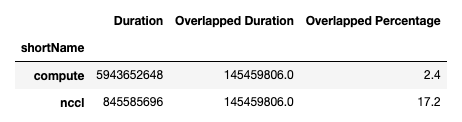
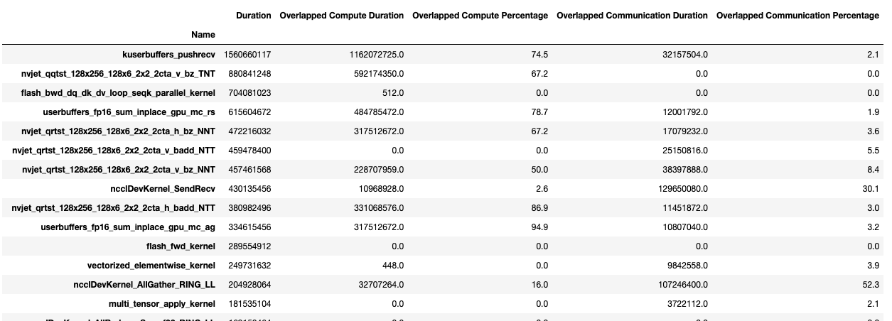
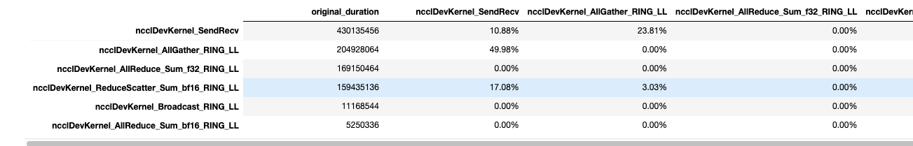
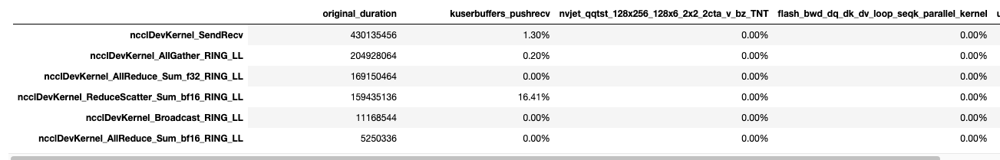
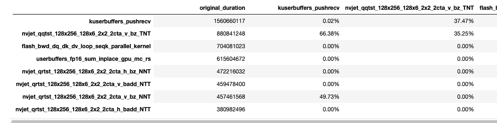

# nsys_recipes
## Introduction
these recipes are a supplement to nsight system‘s build in multi-report recipe. 
this recipe is tested in nsight systems version 25.3.1
previous nsys_recipes in tag nsys24 can't be used in nsys25.

currently we have 2 custom recipe.   
**nccl_gpu_overlap_trace**:   
the nccl_gpu_overlap_trace is modified version from original nccl_gpu_overlap_trace, add some new static.
- communication compute overall 
- Grouped Traces
- Kernel overlao matrix

**kernel_overlap_trace**:   
if your nsys timeline has no nccl or deepep kernels, you will have some error in nccl_gpu_overlap_trace, in this case, you can use kernel_overlap_trace to see the kernel overlap matrix. it's same with nccl_gpu_overlap_trace's kernel overlap matrix.

1. communication compute overall, a example output like bellow:
in this part, compute, communication and overlap duration can be considered as a projection duration. for example if 2 communication kernel has some overlap, the duration is considered only once in nccl. and the overlaped duration is the overlaped duration across compute and communication.
in the "all" streamId part, it's a overall of all streams.
in the specific streamId part, we only summary the communication in each stream. it's for user to know the communication of different parallelism.  
 

2. Grouped Traces v2, a example output like bellow:
in original grouped traces, if 2 kernel with same name has some overlaped duration, it will be counted multi times. in the new grouped graces, it will not be counted multi times. but if 2 different named kernel has some overlap, the overlaped duration is counted multi times, so as the original grouped trace.
 

3. comm_comm, comm_compute, compute_compute overlap matrix, like bellow:
 
 
 

## Prerequisites

Before using the recipes, I strongly recommended you to read the following:

- Installation guide (https://docs.nvidia.com/nsight-systems/InstallationGuide/index.html) 
- Pay atttention to the "Post-Collection Analysis Guide", you can get step by step on using this feature.

## Usage
clone this repository and add it to the package
```
git clone git@github.com:hyxcl/nsys_recipes.git
sudo rsync -aPp nsys_recipes/lib/* /opt/nvidia/nsight-systems/2025.3.1/target-linux-x64/python/packages/nsys_recipe/lib/
sudo rsync -aPp nsys_recipes/recipes/ /opt/nvidia/nsight-systems/2025.3.1/target-linux-x64/python/packages/nsys_recipe/recipes/
```

run analysis command:
```
nsys recipe nccl_gpu_overlap_trace --input ./profile/ --output ./output/nccl_gpu_overlap_trace
```
or
```
nsys recipe nccl_gpu_overlap_trace --input ./profile/ --output ./output/nccl_gpu_overlap_trace --self-overlap
```

the `--self-overlap` is optional, it will compuet the overlaped duration of the same named kernel, if add, it will takes much more time.


